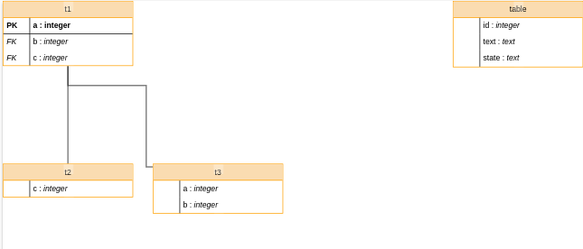

# react-database-diagram

A react component to render nice database diagram using storm-react-diagrams



# Usage
```javascript
import * as React from "react";
import * as ReactDOM from "react-dom";

import DatabaseDiagram, { IDatabaseTable } from "@cybertec/react-database-diagram";

const schema = [{
    columns: [
      { name: "a", type: "integer" },
      { name: "b", type: "integer" },
      { name: "c", type: "integer" }
    ],
    table_name: "t1",
    foreign_keys: [
      {
        toTable: "t2",
        toSchema: "public",
        toColumns: ["c"],
        fromColumns: ["c"]
      },
    ],
    primary_keys: ["a"],
    table_schema: "cypex_generated"
  },
  {
    columns: [{ name: "c", type: "integer" }],
    table_name: "t2",
    foreign_keys: [],
    table_schema: "cypex_generated"
  },] as IDatabaseTable;

  ReactDOM.render(<DatabaseDiagram schema={schema} />, document.body);

```

You can also check out the [`demo`](https://github.com/cybertec-postgresql/react-database-diagram/tree/master/demo) in the demo folder.

# TODO

- [ ] Add custom relations line
- [ ] Add m:n display
- [ ] Add tests